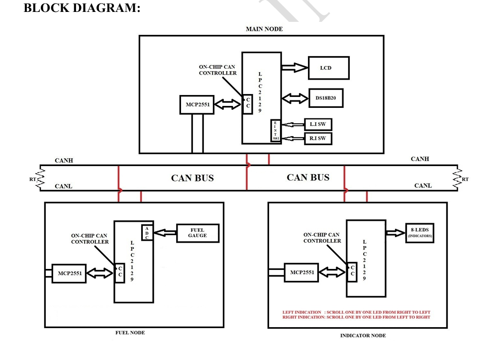
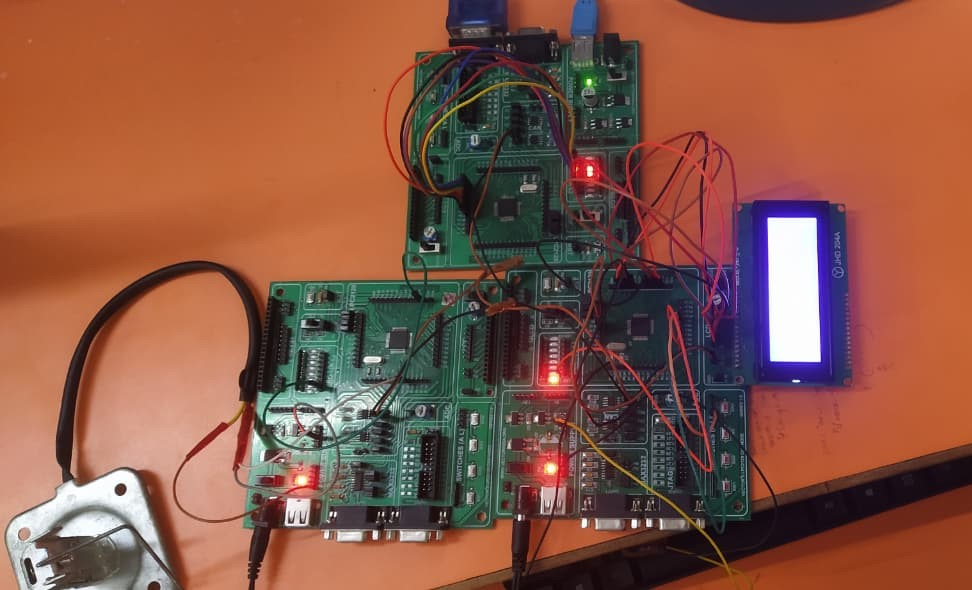
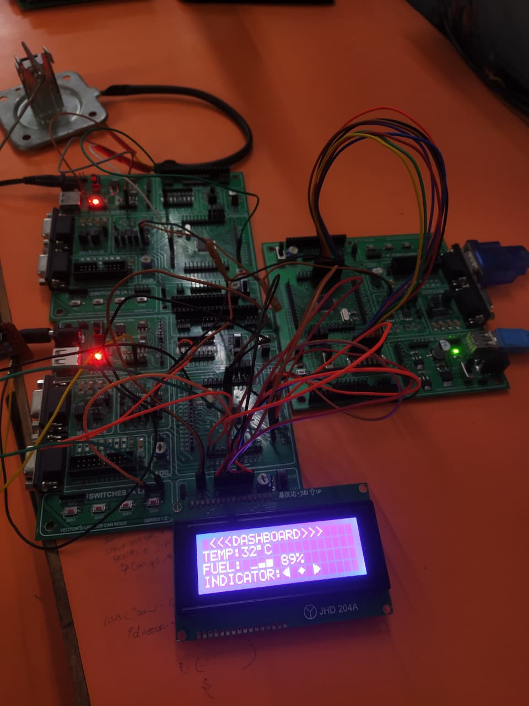
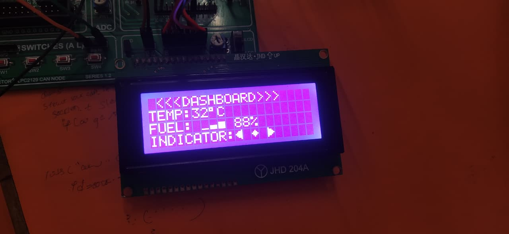

# 🚗Automotive-Parameter-Monitoring-Using-CAN (LPC2129)

## 📌 Project Overview
This project implements a **multi-node automotive dashboard system** using the **Controller Area Network (CAN) protocol**. The system consists of three nodes — **Main Node, Fuel Node, and Indicator Node** — communicating over a CAN bus to display real-time vehicle parameters like temperature, fuel level, and indicator status on an LCD.

🌡️ Engine Temperature — measured using DS18B20 digital temperature sensor (1-Wire interface)  
⛽ Fuel Level — acquired using ADC-based analog sensor and transmitted as percentage (0–100%)  
🔄 Turn Indicators (Left/Right) — controlled via switches and executed using LED blinking patterns  
📡 CAN Communication — reliable multi-node data exchange using CAN protocol  
📟 Live Display — all parameters are displayed in real-time on a 20×4 LCD

A central **Main Node** acts as the controller and display unit. It receives sensor data from other nodes over the CAN bus, processes it, and continuously updates the dashboard. The system demonstrates a distributed embedded architecture similar to real automotive networks.

---

## 🧠 System Architecture
The system follows a **distributed architecture**:

- **Main Node (Master)**
  - Displays data on LCD
  - Reads temperature sensor
  - Controls indicators via switches

- **Fuel Node**
  - Reads fuel level using ADC
  - Sends fuel data over CAN

- **Indicator Node**
  - Controls LED indicators
  - Receives commands from Main Node

---

## 🧩 Block Diagram

---

## 🔧 Hardware Setup

---

## 🔌 CAN Network

---

## 📟 LCD Output

---

## ⚙️ Components Used

- LPC2129 (ARM7 Microcontroller)
- MCP2551 CAN Transceiver
- DS18B20 Temperature Sensor
- 20x4 LCD 
- Fuel Sensor (Analog via ADC)
- LEDs (Indicators)
- Switches
- Power Supply

---

## 🛠️ Software & Tools

- Embedded C
- Keil µVision IDE
- Flash Magic
- CAN Protocol (ISO 11898)

---

## 📂 Project Structure
MAJOR_PROJECT/
    ├── MAIN_NODE.c          # Main node: LCD display + CAN hub
    ├── FUEL_NODE.c          # Fuel sensor node: ADC → CAN TX
    ├── INDICATOR_NODE.c     # Indicator node: CAN RX → LED blinker
    ├── CAN.c / can.h        # CAN bus driver (init, TX, RX)
    ├── can_defines.h        # CAN register & bit definitions
    ├── ds18b20.c / .h       # DS18B20 1-Wire temperature driver
    ├── MMA_7660.c / .h      # MMA7660 accelerometer I2C driver
    ├── LCD.c / lcd.h        # 20×4 LCD character driver
    ├── lcd_defines.h        # LCD command constants
    ├── I2C.c / i2c.h        # Bit-bang I2C master driver
    ├── INDICATOR.c / .h     # LED indicator step logic (left/right/off)
    ├── INDICATOR_GEN.c      # Indicator pattern generator
    ├── FUEL.c / fuel.h      # Fuel ADC read & scaling logic
    ├── delay.c / delay.h    # Microsecond / millisecond software delay
    ├── defines.h            # Bit manipulation macros (SETBIT, CLRBIT, etc.)
    ├── types.h              # Typedefs: u8, u32, s8, f32, etc.
    ├── Startup.s            # ARM7 reset & vector table (assembly)
    ├── major.uvproj         # Keil µVision project file
    ├── MAIN_NODE.hex        # Compiled firmware — flash to Main Node board
    ├── FUEL_NODE.hex        # Compiled firmware — flash to Fuel Node board
    └── IND_NODE.hex         # Compiled firmware — flash to Indicator Node board

MAJOR_PROJECT/
├── MainNode.c
├── FuelNode.c
├── IndicatorNode.c
├── can.c
├── can.h
├── can_defines.h
├── ds18b20.c
├── ds18b20.h
├── lcd.c
├── lcd.h
├── lcd_defines.h
├── FUEL_adc.c
├── fuel_adc.h
├── fuel_defines.h
├── INDICATOR.c
├── indicator.h
├── EXINT.c
├── delay.c
├── delay.h
├── defines.h
├── types.h
├── Startup.s
├── system.c
├── major.uvproj
├── MAIN_NODE.hex
├── FUEL_NODE.hex
└── IND_NODE.hex
---

## 🚀 Getting Started

### 🔹 Prerequisites
- Keil µVision
- Flash Magic
- LPC2129 Board
- CAN Setup (MCP2551)

---

### 🔹 Build & Flash
1. Open project in Keil
2. Compile the code
3. Generate `.hex` file
4. Flash using Flash Magic

---

### 🔹 CAN Bus Wiring
- Connect:
  - CANH ↔ CANH
  - CANL ↔ CANL
- Add **120Ω resistors** at both ends

---

### 🔹 Pin Configuration (LPC2129)

| Peripheral | Pins |
|-----------|------|
| CAN TX    | P0.0 |
| CAN RX    | P0.1 |
| LCD       | GPIO |
| ADC       | AD0.x |
| Switches  | GPIO |
| LEDs      | GPIO |

---

## 📊 Working

1. Fuel Node reads fuel level → sends via CAN  
2. Indicator Node controls LEDs based on command  
3. Main Node:
   - Reads temperature  
   - Receives fuel data  
   - Sends indicator control  
   - Displays all data on LCD  

---

## 💡 Key Features

- Multi-node CAN communication  
- Real-time dashboard  
- Embedded system design  
- Scalable architecture  

---

## 📚 Key Learnings

- CAN Protocol implementation  
- Embedded C programming  
- Sensor interfacing  
- Real-time systems  

---

## ⭐ Future Enhancements

- Speed sensor integration  
- IoT-based monitoring  
- Mobile app dashboard  
- Fault detection system  

---

## 👨‍💻 Author

**Sanskruti Manusmare**-Embedded Systems Major Project

**Platform**-Vector India's LPC2129 CAN Node Board|Keil µVision|Flash Magic

---
